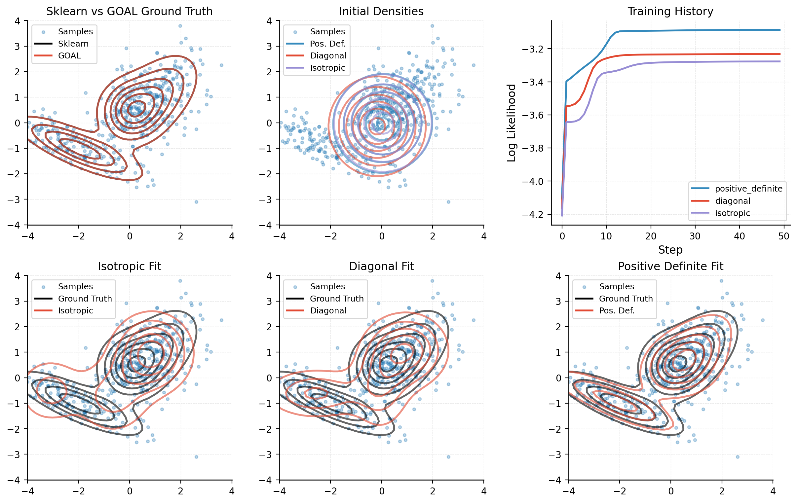

Goal: Geometric OptimizAtion Libraries
======================================

**(G)eometric (O)ptimiz(A)tion (L)ibraries**

A JAX framework for statistical modeling grounded in information geometry and exponential families.

Overview
--------

Goal provides machine learning algorithms based on the theory of statistical manifolds --- mathematical spaces where every point is a probability distribution. In Goal we implement statistical manifolds as lightweight, stateless objects that define operations on flat JAX arrays. This design allows us to define high-level algorithms for inference, learning, and model evaluation, and deploy them in complex latent variable models.

Installation
------------

Install from PyPI::

   pip install goal-jax

For development::

   git clone https://github.com/alex404/goal-jax.git
   cd goal-jax
   uv sync --all-extras

Quick Start
-----------

Fit a 3-component Gaussian mixture model via expectation-maximization:

.. code-block:: python

   import jax
   import jax.numpy as jnp
   from goal.geometry import PositiveDefinite
   from goal.models import AnalyticMixture, Normal

   # 3-component 2D Gaussian mixture with full covariance
   model = AnalyticMixture(Normal(2, PositiveDefinite()), n_components=3)

   # Generate synthetic data from a known mixture
   key = jax.random.PRNGKey(0)
   ground_truth = model.initialize(key)
   sample = model.observable_sample(key, ground_truth, n=500)

   # Fit via expectation-maximization
   key, subkey = jax.random.split(key)
   params = model.initialize(subkey)

   def em_step(params, _):
       return model.expectation_maximization(params, sample), None

   params, _ = jax.lax.scan(em_step, params, None, length=50)

   # Evaluate fit
   ll = model.average_log_observable_density(params, sample)

The full example compares full, diagonal, and isotropic covariance across EM iterations --- see :doc:`examples`:

Library Structure
-----------------

The library is organized in two packages: **geometry** (abstract mathematical machinery) and **models** (concrete statistical distributions).

Geometry
~~~~~~~~

The :doc:`geometry package <geometry/index>` provides two layers:

- :doc:`geometry/manifold/index` --- Geometric primitives: manifolds, matrix representations, embeddings, and linear maps. A manifold is a stateless object that pairs a dimension with operations on flat JAX arrays.

- :doc:`geometry/exponential_family/index` --- Statistical manifolds with increasing capabilities:

  - **ExponentialFamily** --- sufficient statistics and base measure
  - **Generative** --- additionally supports sampling
  - **Differentiable** --- analytic log-partition function, enabling gradient-based optimization
  - **Analytic** --- analytic negative entropy, enabling closed-form algorithms (e.g. EM)

  Composed models (harmoniums, graphical models) recapitulate this hierarchy, mixing their own structure with these capability levels.

Models
~~~~~~

The :doc:`models package <models/index>` builds concrete distributions on this foundation:

- :doc:`models/base/index` --- Fundamental exponential family distributions:

  .. list-table::
     :header-rows: 1
     :widths: 25 35 40

     * - Distribution
       - Sufficient Statistic
       - Base Measure
     * - **Bernoulli**
       - $x \in \{0,1\}$
       - $0$
     * - **Categorical**
       - One-hot encoding for $k > 0$
       - $0$
     * - **Binomial**
       - Count $x$
       - $\log \binom{n}{x}$
     * - **Poisson**
       - Count $k$
       - $-\log(k!)$
     * - **CoM-Poisson**
       - $(k, \log(k!))$
       - $0$
     * - **von Mises**
       - $(\cos(\theta), \sin(\theta))$
       - $-\log(2\pi)$
     * - **Normal**
       - $(x, x \otimes x)$
       - $-\frac{d}{2}\log(2\pi)$
     * - **Boltzmann**
       - $x \otimes x$
       - $0$

- :doc:`models/harmonium/index` --- Conjugate latent-variable models where observed and latent variables form a joint exponential family:

  - **Mixture models** --- EM-based clustering over any base distribution, with analytic E-steps from conjugate structure
  - **Linear Gaussian models** --- factor analysis and PCA, recovering low-rank covariance structure from high-dimensional observations
  - **Population codes** --- neural population models for circular stimulus decoding from Poisson spike data

- :doc:`models/graphical/index` --- Hierarchical models that compose multiple harmoniums into deeper structures. A top-level mixture selects among components, each of which is itself a latent-variable model:

  - **Mixture of factor analyzers** --- per-component low-rank structure with shared dimensionality reduction
  - **Hierarchical mixture of Gaussians** --- hierarchical combination of LGMs
    and mixture models

.. toctree::
   :maxdepth: 1
   :caption: Contents:
   :hidden:

   geometry/index
   models/index
   examples
